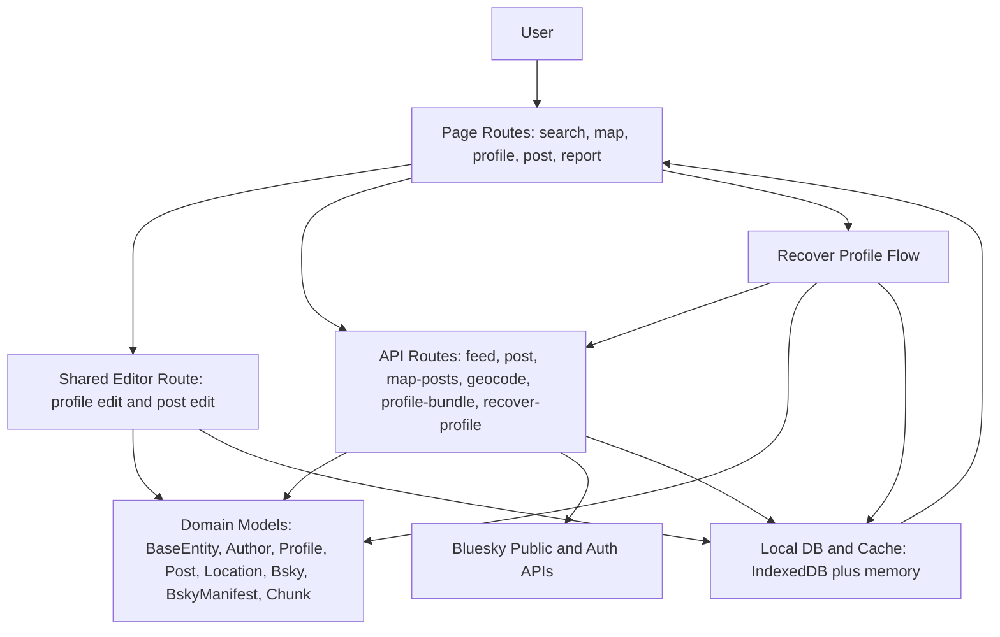
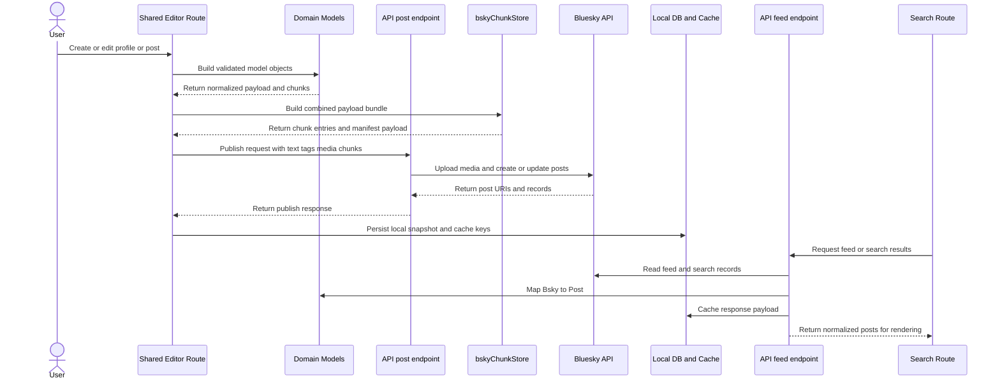

# Love4Dogs

Love4Dogs is a SvelteKit app for creating, publishing, discovering, and moderating pet profiles/posts stored on Bluesky-compatible records, with local-first caching and recovery flows.

## Quick Start

Install dependencies:

```sh
npm install
```

Run locally:

```sh
npm run dev
```

Compile check:

```sh
npx vite build
```

Full project build pipeline (includes regression scripts):

```sh
npm run build
```

## Architecture Overview

This app has 4 primary layers:

1. UI and route layer in [src/routes](src/routes) and [src/lib](src/lib) Svelte components.
2. Domain model layer in [src/lib/models.js](src/lib/models.js) and [src/lib/schema.js](src/lib/schema.js).
3. Data and sync layer in [src/lib/db.js](src/lib/db.js), [src/lib/profileRegistry.js](src/lib/profileRegistry.js), and [src/lib/bskyChunkStore.js](src/lib/bskyChunkStore.js).
4. API integration layer in [src/routes/api](src/routes/api) endpoints for feed, posts, geocoding, cache, profile recovery, and DM/moderation.

## Class Model

Core classes are implemented in [src/lib/models.js](src/lib/models.js).

1. `BaseEntity`
2. Responsibility: shared entity identity and normalization (`type`, `uuid`, `authorid`, `tags`, `location`).
3. Key behavior: `toBaseJSON()`, `isProfile()`.

1. `Author` extends `BaseEntity`
2. Responsibility: author identity and integrity (`id`, `did`, `handle`, display name/avatar).
3. Key behavior: `hasIdentity()`, `getDisplayLabel()`, `getValidationErrors()`, `isValid()`, `assertIntegrity()`.

1. `Profile` extends `Author`
2. Responsibility: persisted profile author data (email/pin/profile text/media/location state).
3. Key behavior: `toStoredProfile()`, `toRegistryEntry()`.

1. `Post` extends `BaseEntity`
2. Responsibility: non-profile post records with media, facets, engagement, and geohash-derived location fields.
3. Key behavior: normalized post payload creation and serialization via `toJSON()`.

1. `Location`
2. Responsibility: coordinate and address integrity.
3. Key behavior: `hasCoordinates()`, `hasRequiredAddressParts()`, `buildCompleteAddress()`, `matchesAddress()`, `getValidationErrors()`, `assertIntegrity()`.

1. `CommentStars`
2. Responsibility: aggregate comment/reply/repost/like/star counters.
3. Key behavior: normalized engagement payload and serialization.

1. `Bsky`
2. Responsibility: normalized Bluesky source view (`record`, `embed`, `author`, counts).
3. Key behavior: media accessors (`mediaView`, `imageViews`, `videoView`) and safe JSON projection.

1. `Chunk`
2. Responsibility: chunk metadata for large bundle payload fragments.
3. Key behavior: payload fragment normalization (`index`, `total`, `bundleFragment`, compression flag).

1. `BskyManifest`
2. Responsibility: canonical publish/read bundle metadata (`uuid`, `type`, `author`, description, media, chunks, location).
3. Key behavior: profile detection and compatibility serialization for publish contracts.

1. `DbCacheEntry`
2. Responsibility: normalize cache records with coherent `cachedAt` metadata.

1. `DbCacheStore`
2. Responsibility: store-level eviction/pruning behavior for cache maps.

Compatibility class in [src/lib/schema.js](src/lib/schema.js):

1. `BlueskySchemaRecord` extends `BskyManifest`
2. Responsibility: schema compatibility aliases (`title`, `html`, `canonicalurl`) while preserving manifest integrity.

## Routes

### App Pages

1. `/` via [src/routes/+page.js](src/routes/+page.js): redirects to search.
2. `/search/[...terms]` via [src/routes/search/[...terms]/+page.svelte](src/routes/search/[...terms]/+page.svelte): primary feed/search UI with filtering, caching, pagination, and card rendering.
3. `/map/[...terms]` via [src/routes/map/[...terms]/+page.svelte](src/routes/map/[...terms]/+page.svelte): map browsing and map-centered location display.
4. `/profile` via [src/routes/profile/+page.js](src/routes/profile/+page.js): redirects to profile picker.
5. `/profile/select` via [src/routes/profile/select/+page.svelte](src/routes/profile/select/+page.svelte): choose current local profile identity.
6. `/profile/new` via [src/routes/profile/new/+page.js](src/routes/profile/new/+page.js): redirects to generated profile edit path.
7. `/profile/edit/...` via [src/routes/profile/edit/+page.svelte](src/routes/profile/edit/+page.svelte) and [src/routes/profile/edit/[[uuid]]/[...slug]/+page.svelte](src/routes/profile/edit/[[uuid]]/[...slug]/+page.svelte): shared create/edit/publish flow for profiles and posts.
8. `/profile/view/[uuid]/[...slug]` via [src/routes/profile/view/[uuid]/[...slug]/+page.svelte](src/routes/profile/view/[uuid]/[...slug]/+page.svelte): profile display (delegates to bundle viewer).
9. `/post/new` via [src/routes/post/new/+page.js](src/routes/post/new/+page.js): redirects to generated post edit path.
10. `/post/edit/...` via [src/routes/post/edit/[[uuid]]/[...slug]/+page.svelte](src/routes/post/edit/[[uuid]]/[...slug]/+page.svelte): post edit entry that reuses shared editor route.
11. `/post/view/[uuid]/[...slug]` via [src/routes/post/view/[uuid]/[...slug]/+page.svelte](src/routes/post/view/[uuid]/[...slug]/+page.svelte): post display (delegates to bundle viewer).
12. `/search/profile` via [src/routes/search/profile/+page.svelte](src/routes/search/profile/+page.svelte): recover profile by Bluesky URL.
13. `/report/[uuid]` via [src/routes/report/[uuid]/+page.svelte](src/routes/report/[uuid]/+page.svelte): report workflow (sends moderation payload via DM API).
14. `/settings` via [src/routes/settings/+page.svelte](src/routes/settings/+page.svelte): settings shell.
15. `/about` via [src/routes/about/+page.svelte](src/routes/about/+page.svelte): about content.

### API Routes

1. `/api/feed` via [src/routes/api/feed/+server.js](src/routes/api/feed/+server.js): fetch/search feed from Bluesky, map into `Bsky` + `Post`, cache response.
2. `/api/post` via [src/routes/api/post/+server.js](src/routes/api/post/+server.js): publish/update/delete operations, media upload/resolve, tag/facet processing.
3. `/api/map-posts` via [src/routes/api/map-posts/+server.js](src/routes/api/map-posts/+server.js): map-cell post lookup by geohash with caching/throttling.
4. `/api/geocode` via [src/routes/api/geocode/+server.js](src/routes/api/geocode/+server.js): forward/reverse geocode and address validation.
5. `/api/profile-bundle` via [src/routes/api/profile-bundle/+server.js](src/routes/api/profile-bundle/+server.js): load/cache reconstructed profile bundle.
6. `/api/recover-profile-from-post` via [src/routes/api/recover-profile-from-post/+server.js](src/routes/api/recover-profile-from-post/+server.js): reconstruct profile bundle from thread chunk payloads.
7. `/api/post-by-canonical-url` via [src/routes/api/post-by-canonical-url/+server.js](src/routes/api/post-by-canonical-url/+server.js): resolve post/profile by canonical URL or uuid-like key.
8. `/api/send-dm` via [src/routes/api/send-dm/+server.js](src/routes/api/send-dm/+server.js): send moderation/utility payloads via Bluesky chat.
9. `/api/cache` via [src/routes/api/cache/+server.js](src/routes/api/cache/+server.js): clear targeted cache records.
10. `/api/cache/all` via [src/routes/api/cache/all/+server.js](src/routes/api/cache/all/+server.js): inspect or clear all cached post keys.
11. `/api/check-cdn` via [src/routes/api/check-cdn/+server.js](src/routes/api/check-cdn/+server.js): health-check CDN image URLs.
12. `/api/download-image` via [src/routes/api/download-image/+server.js](src/routes/api/download-image/+server.js): image proxy/download helper.

## How Classes and Routes Interact

1. UI routes collect user input and rendering state.
2. Editor/profile flows build model objects (`Profile`, `Location`, `BskyManifest`, `Chunk`) before serialization.
3. API routes convert upstream Bluesky records into `Bsky` and then `Post` domain objects before returning data.
4. Storage paths normalize writes through `DbCacheEntry`, `DbCacheStore`, and profile registry helpers.
5. Recovery flows parse chunk payloads and reconstruct manifests/profiles back into local storage.

## Interaction Diagram



## Publish Sequence Diagram



## Notes

1. The model layer is the integrity boundary: normalize/validate in classes first, then serialize.
2. `Profile` is intentionally modeled as an `Author` subclass to keep identity semantics consistent.
3. Read-side route handlers consume normalized class outputs rather than loosely shaped objects wherever possible.
